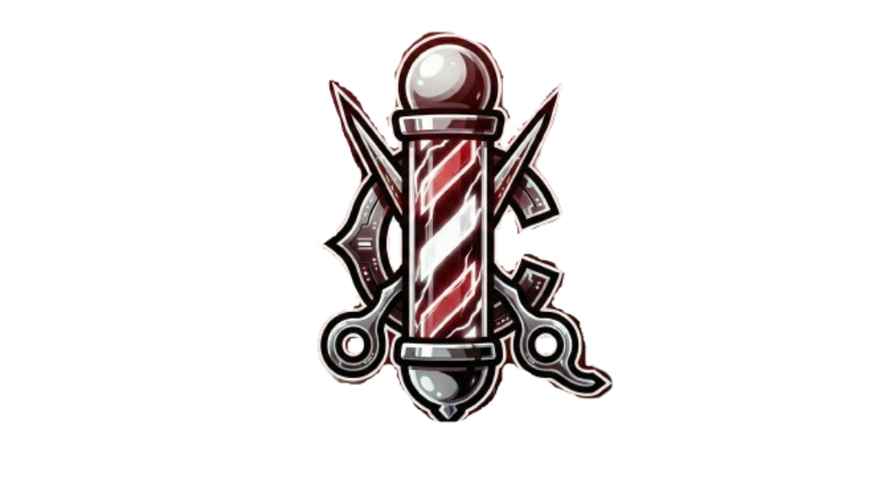

# THE BARBER COMPANY - Estilo Tático



> "Missão: Estilo Impecável. Cortes de precisão, ambiente tático e profissionais de elite."

## 📋 Sobre o Projeto

**The Barber Company** é uma landing page moderna e responsiva desenvolvida para uma barbearia com temática tática inspirada no universo gamer (Valorant) e black-ops. O projeto foca em uma experiência visual imersiva, alta performance e conversão de agendamentos.

### ✨ Funcionalidades Principais

*   **Design Tático & Responsivo**: Layout agressivo e elegante (`#0f1923`), 100% adaptado para Mobile, Tablet e Desktop.
*   **Menu Mobile Interativo**: Navegação estilo "Overlay" com animações fluidas.
*   **Sistema de Agendamento (Modal)**: Fluxo intuitivo de 3 passos (Serviço -> Agente -> Confirmação) sem recarregar a página.
*   **Galeria Dinâmica**: Exibição de cortes e estilo do ambiente.
*   **Animações FX**: Uso de `Framer Motion` e CSS puro para efeitos de "Glitch", "Slide-in" e transições suaves.
*   **SEO & Social**: Otimizado com meta tags Open Graph para compartilhamento rico no WhatsApp e Redes Sociais.

## 🛠️ Tecnologias Utilizadas

*   **[React](https://reactjs.org/)**: Biblioteca principal para construção da interface.
*   **[Vite](https://vitejs.dev/)**: Build tool ultrarrápida.
*   **[Tailwind CSS](https://tailwindcss.com/)**: Framework de estilização utility-first.
*   **[Framer Motion](https://www.framer.com/motion/)**: Biblioteca para animações complexas.
*   **[React Icons](https://react-icons.github.io/react-icons/)**: Ícones vetoriais leves.
*   **TypeScript**: Tipagem estática para código mais seguro.

## 🚀 Como Executar o Projeto

### Pré-requisitos

*   Node.js instalado (versão 18+ recomendada).

### Instalação

1.  Clone o repositório:
    ```bash
    git clone https://github.com/RobsonMarcolino/The-barber-Company.git
    ```
2.  Entre na pasta do projeto:
    ```bash
    cd BarbeariaVL
    ```
3.  Instale as dependências:
    ```bash
    npm install
    ```

### Rodando Localmente

Para iniciar o servidor de desenvolvimento:

```bash
npm run dev
```

O projeto estará acessível em `http://localhost:5173`.

### Build para Produção

Para gerar a versão otimizada para produção:

```bash
npm run build
```

## 🌐 Deploy (GitHub Pages)

Este projeto já está configurado para deploy automático no GitHub Pages.

Para publicar uma nova versão:

1.  Certifique-se de que suas alterações estão commitadas.
2.  Execute o comando:
    ```bash
    npm run deploy
    ```
3.  Acesse em: `https://RobsonMarcolino.github.io/The-barber-Company/`

## 🤝 Contribuição

Contribuições são bem-vindas! Se você tiver sugestões para melhorar este projeto tático, sinta-se à vontade para abrir uma issue ou enviar um pull request.

---

<p align="center">
  Desenvolvido com 🎯 Precisão e Estilo.
</p>
